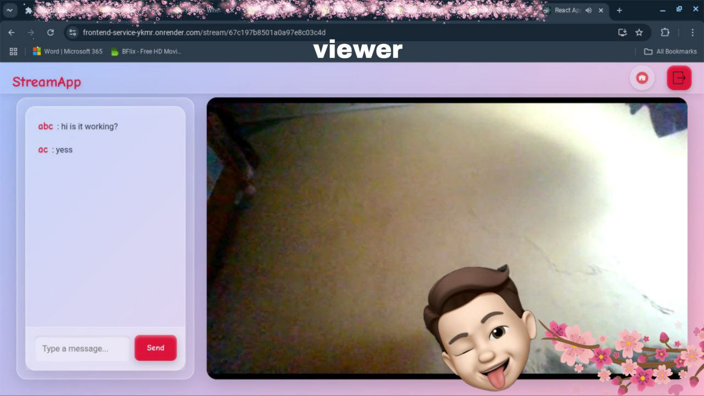
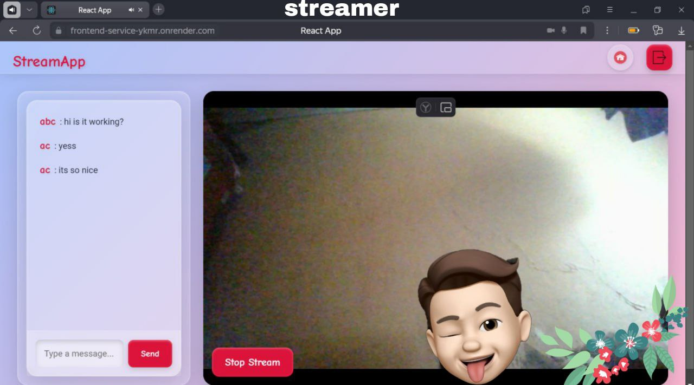
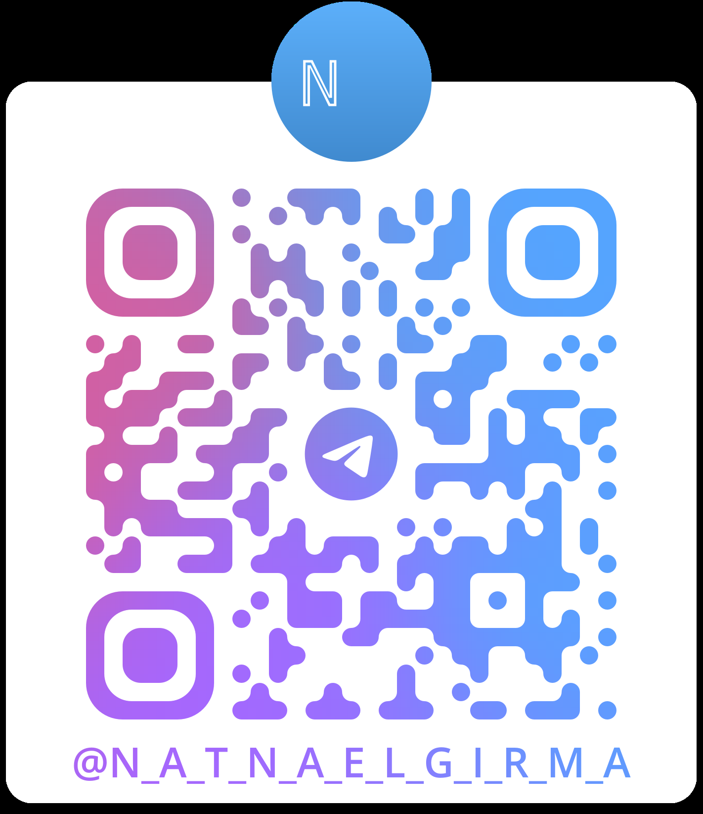

# Loca.Live

<div align="center">
  
</div>

<pre align="center">
   <strong>Welcome to Loca.Live</strong>
a vibrant live streaming platform that connects creators and viewers
   in real-time with a playful, modern twist!
</pre>

Project Objective
Loca.Live is all about making live streaming effortless, engaging, and scalable. My mission:

Empower streamers to broadcast, resume, and stop streams with a sleek, intuitive UI.
Enable viewers to dive into live action and chat instantly.
Deliver a developer-friendly, modular platform using microservices and serverless tech.
Built with cutting-edge tools, Loca.Live blends WebRTC streaming with a neuromorphic/glassmorphic design, creating a seamless experience for all users.

### Tech Stack

- **Frontend:** React, Axios, CSS (Glassmorphism & Neuromorphism), WebRTC
- **Backend:** Node.js, Express, MongoDB, Mongoose, WebSocket (ws)
- **Infrastructure:** Render (Serverless), Microservices (API Gateway, Auth, Stream, Chat)
- **Dev Tools:** Git, GitHub, npm, ESLint, VS Code
- **External APIs:** STUN/TURN (Google STUN, OpenRelay TURN)
  
Features
Live Streaming: Real-time video/audio via WebRTC with low latency.
Interactive Chat: WebSocket-powered messaging for instant viewer engagement.
Stunning UI: Cartoonish, minimalist design with glassmorphic and neuromorphic flair, responsive across devices.
Stream Control: Start, resume, and stop streams with secure user authentication.
Scalable Backend: Microservices architecture for flexibility and growth.
Serverless Power: Deployed on Render for effortless scaling and maintenance.
Microservices Architecture
Loca.Live thrives on a modular microservices setup:

API Gateway: Routes all requests (auth, streams, chat) with Express, ensuring secure access.
Auth Service: Handles signup, login, and token verification, powered by MongoDB and JWT.
Stream Service: Manages stream lifecycle (start, stop, list) and WebRTC signaling via WebSocket.
Chat Service: Enables real-time chat with WebSocket and MongoDB persistence.
Each service is a standalone Node.js app, keeping the system decoupled and robust.

Serverless Deployment
Hosted on Render, Loca.Live leverages serverless magic:

Auto-Scaling: Adapts to traffic spikes seamlessly.
Easy Deploys: GitHub-integrated, one-click deployments.
Cost-Smart: Free tier for microservices, HTTPS included.
Real-Time Ready: Supports WebSocket for streaming and chat.
No server headaches—just pure focus on building an awesome experience!

<b>Live Demo</b>

<p>Notice: If it is not working might be in sleep mode to open since i am using free tier of render contact me so i can wake all micro services</p>
click me:<span>-</span>
<a href="https://frontend-service-ykmr.onrender.com/">loca.live</a>

Screenshots

<div style="gap: 20px; margin: 20px 0;"> <div style="text-align: center;">  <p style="font-family: Arial, sans-serif; color: #333; font-size: 1em;">Live Streaming in Action</p> </div> <div style="text-align: center;">  <p style="font-family: Arial, sans-serif; color: #333; font-size: 1em;">Real-Time Chat Vibes</p> </div> </div>

Developer

<div style="font-family: Arial, sans-serif; color: #333; text-align: center; margin: 20px 0;"> <p><strong>Crafted with ❤️ by Natnael Girma</strong></p> <p> <a href="https://github.com/codenati22" style="color: #dc143c; text-decoration: none;">GitHub</a> | <a href="https://t.me/n_a_t_n_a_e_l_g_i_r_m_a" style="color: #dc143c; text-decoration: none;">Telegram</a> | <a href="https://www.linkedin.com/in/natnael-girma-707a1a326?utm_source=share&utm_campaign=share_via&utm_content=profile&utm_medium=android_app" style="color: #dc143c; text-decoration: none;">LinkedIn</a> </p> <p style="font-size: 0.9em;">Ping me—I’d love to chat about streaming, code, or collabs!</p> </div>
</a>

Getting Started
Clone the Repo:

```bash
Wrap
Copy
git clone https://github.com/codenati22/frontend-service.git
```

```cmd
cd frontend-service
```

Install Dependencies:

```
Frontend: npm install
API Gateway: clone my repo api-gateway and cd api-gateway && npm install
Stream Service: cd stream-service && npm install
Chat Service: cd chat-service && npm install
Set Environment Variables:
Create .env files in each service folder (check .env.example).
Add MONGO_URI, JWT_SECRET, service URLs, etc.
Run Locally:
Frontend: cd live-stream-frontend && npm start
API Gateway: cd api-gateway && npm start
Stream Service: cd stream-service && npm start
Chat Service: cd chat-service && npm start
Deploy:
```

Push to GitHub, connect to Render for each service.
Contributing
Dig Loca.Live? Want to level it up?

Fork it, branch out, and send a PR with your magic!
Drop bugs or ideas in Issues.
License
Licensed under the MIT License—use it, tweak it, share it!

<div style="text-align: center; font-family: Arial, sans-serif; color: #333; font-size: 1.1em; margin-top: 20px;"> <strong>Loca.Live</strong>—Stream local, connect global. Let’s make waves together! </div>

<div align="center">
  
  
</div>
